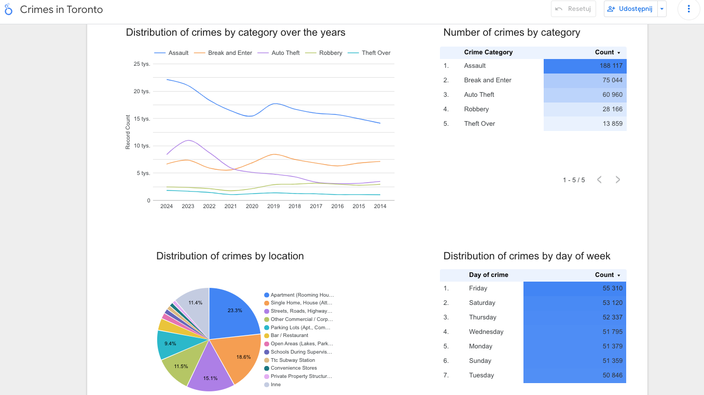

# Crimes in Toronto - Data Engineering Project for Zoomcamp 2025

## Project Overview

This project ingests, processes, and analyzes the **Toronto crime dataset** using a modern data engineering stack on Google Cloud Platform. You will learn how to:

1. **Ingest raw data** from Google Cloud Storage
2. **Transform and enrich** data with PySpark on Dataproc
3. **Load** processed records into a BigQuery data warehouse
4. **Visualize** results in Looker Studio

## Dataset

- **Source:** `crimes-in-toronto.csv`
- **Contents:** Each row represents a reported crime in Toronto, with attributes such as date, location, offense type, and outcome.

## Objectives

- Build a reproducible **Terraform**-managed GCP infrastructure
- Design a scalable **PySpark** pipeline for data cleaning & transformation
- Leverage **BigQuery** for storage, partitioning, and performance tuning
- Create interactive **Looker Studio** dashboards to explore crime trends

## Tech Stack

- **Infrastructure as Code:** Terraform
- **Compute:** Google Cloud Dataproc (PySpark)
- **Storage:** Google Cloud Storage, BigQuery
- **Visualization:** Looker Studio

## Getting Started

Follow the detailed steps in this repository to:

1. Create your GCP account & service credentials
2. Provision infrastructure with Terraform
3. Run your PySpark job on Dataproc
4. Explore data in BigQuery & Looker Studio

---


# ☁️ GCP + Terraform + Dataproc Setup Guide

## 1. Create GCP Account

- Sign up at [https://cloud.google.com](https://cloud.google.com)

## 2. Install `gcloud`

- Follow instructions: [Install Google Cloud CLI](https://cloud.google.com/sdk/docs/install)

## 3. Create Service Account for Terraform

Assign the following roles:

- `BigQuery Admin`
- `Storage Admin`
- `Storage Object Admin`

## 4. Install Terraform

- [Terraform Installation Guide](https://developer.hashicorp.com/terraform/downloads)

> Based on:  
> [DataTalksClub Terraform GCP Guide](https://github.com/DataTalksClub/data-engineering-zoomcamp/blob/main/01-docker-terraform/1_terraform_gcp/2_gcp_overview.md)

## 5. Set Environment Variables

```bash
export GOOGLE_CREDENTIALS=$HOME/.google/credentials/google_credentials.json
export PATH=$HOME/bin/terraform:$PATH
export GOOGLE_APPLICATION_CREDENTIALS=$HOME/.google/credentials/google_credentials.json
```

⚠️ **Important**: Update `spark_sql.py` and `variables.tf` with:

- Your GCP **Project ID**
- Your **Bucket Name(s)**

## 6. Enable Required APIs

Enable in browser:

- [IAM API](https://console.cloud.google.com/apis/library/iam.googleapis.com)
- [IAM Credentials API](https://console.cloud.google.com/apis/library/iamcredentials.googleapis.com)

## 7. Run Terraform

```bash
terraform init
terraform plan
terraform apply
# terraform destroy (optional)
```

## 8. Create Dataproc Cluster (via Web Console)

- Enable **Dataproc API**
- Choose region **same** as in `variables.tf`

⚙️ Update this line in `spark_sql.py`:

```python
spark.conf.set("temporaryGcsBucket", "<YOUR TEMP DATAPROC BUCKET>")
```

## 9. Upload to Terraform-Created Bucket

⚠️ **Important**: Unzip `crimes-in-toronto.gz` to receive `crimes-in-toronto.csv`

Upload the following:

- `spark_sql.py`
- `crimes-in-toronto.csv`

## 10. Submit PySpark Job in Dataproc

- **Job Type**: PySpark
- **Main class or JAR**:  
  `gs://<your-tf-bucket>/spark_sql.py`
- **Arguments**:
  ```bash
  --input_csv_file=gs://<your-bucket>/crimes-in-toronto.csv
  --output_bq_table=dez2025_tf_dataset.crimes
  ```

ℹ️ No need to manually add JARs when using modern Dataproc images.

## 11. Result: BigQuery Table Created

- Table `crimes` now exists in BigQuery under `dez2025_tf_dataset`.

## 12. Run SQL Optimizations in BigQuery

Using `big_query.sql`, perform:

- Creation of **partitioned** table
- Creation of **partitioned & clustered** table
- Comparison of **scan performance** between table types

✅ Result: Partitions and clusters improve performance.

## 13. Final Result: Looker Studio Report

View the report here:  
📊 [Looker Report](https://lookerstudio.google.com/reporting/107f5bc7-2939-4f78-9db9-3eea07a72e44)


## Evaluation Criteria Helper for Peer Reviewers

- Problem description
  - ✅ 4 points: Problem is well described and it's clear what the problem the project solves
- Cloud
  - ✅ 4 points: The project is developed in the cloud and IaC tools are used
- Data ingestion (choose either batch or stream)
  - ✅ Batch
  - ❌ Workflow orchestration
- Data warehouse
  - ✅ 4 points: Tables are partitioned and clustered in a way that makes sense for the upstream queries (with explanation)
- Transformations (dbt, spark, etc)
  - ✅ 4 points: Tranformations are defined with Spark
- Dashboard
  - ✅ 4 points: A dashboard with 2 tiles
- Reproducibility
  - ⚖️ 2 points: Some instructions are there, but they are not complete
  - ⚖️ 4 points: Instructions are clear, it's easy to run the code, and the code works
